# Creating a blank project

To install AR Foundation, we need to keep two things in mind:

1. It is a package provided by Unity, so it must be installed through the Package Manager.
2. To use it on a specific platform (iOS, Android, Magic Leap, and/or HoloLens), we must install the corresponding platform modules.



***

## Installation Options

#### Option 1: Add the packages manually (Preferred)

* Create a project using any 3D template.

<figure>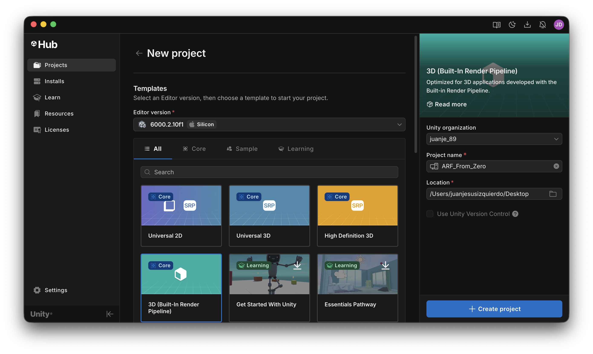<figcaption></figcaption></figure>

* From the **Package Manager** window, install the **AR Foundation** package.

<figure>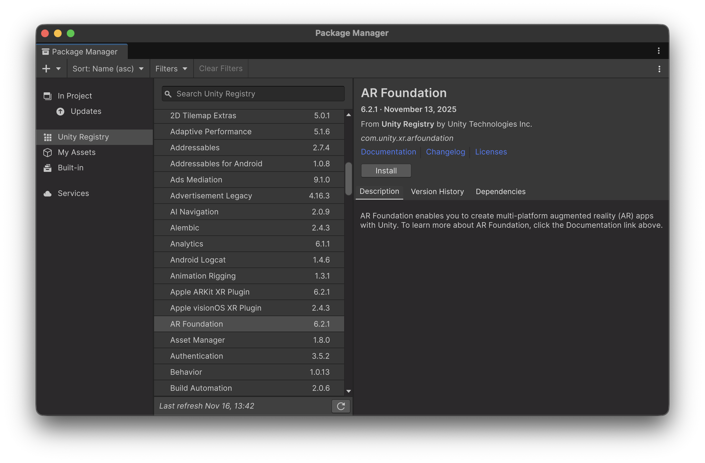<figcaption></figcaption></figure>

* Install the necessary provider plug-ins depending on the platforms you want to develop for using the **Package Manager**, such as AR Core and AR Kit:

<figure>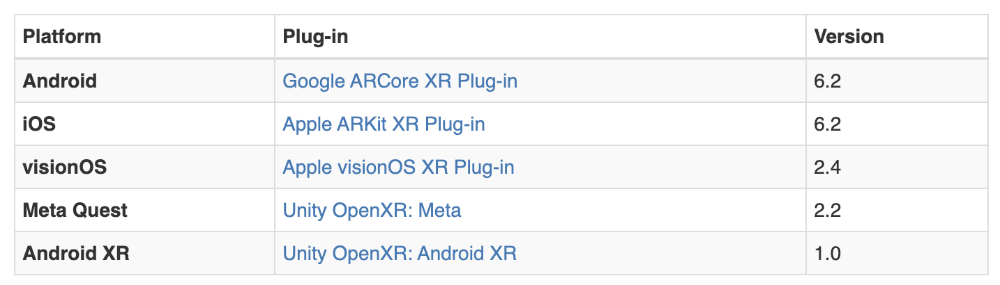<figcaption></figcaption></figure>

<figure>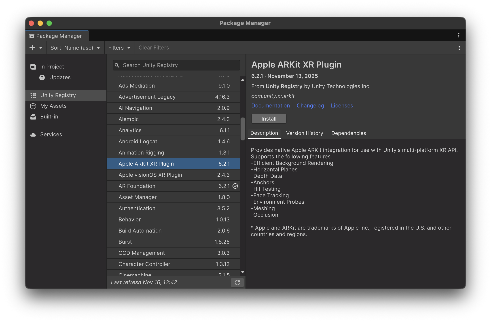<figcaption></figcaption></figure> <figure>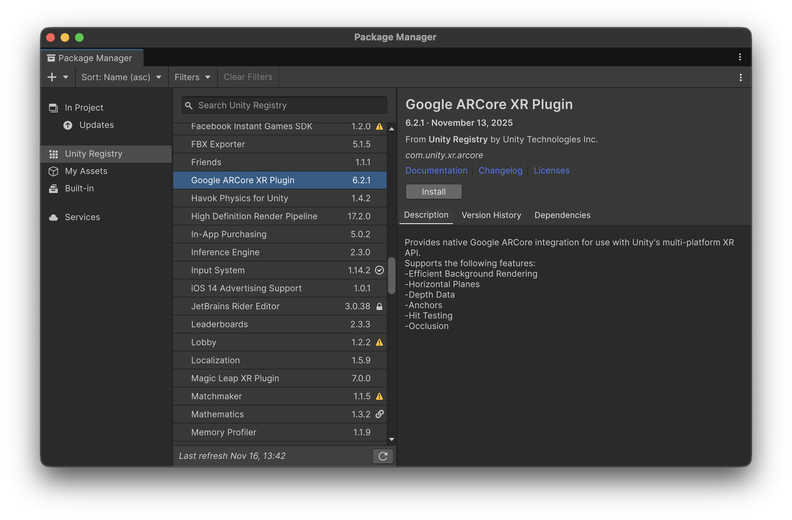<figcaption></figcaption></figure>

* The last step is to **activate the providers**.

#### Option 2: Use a template

The other alternative is to create a project using the "**AR Mobile**" template:

<figure>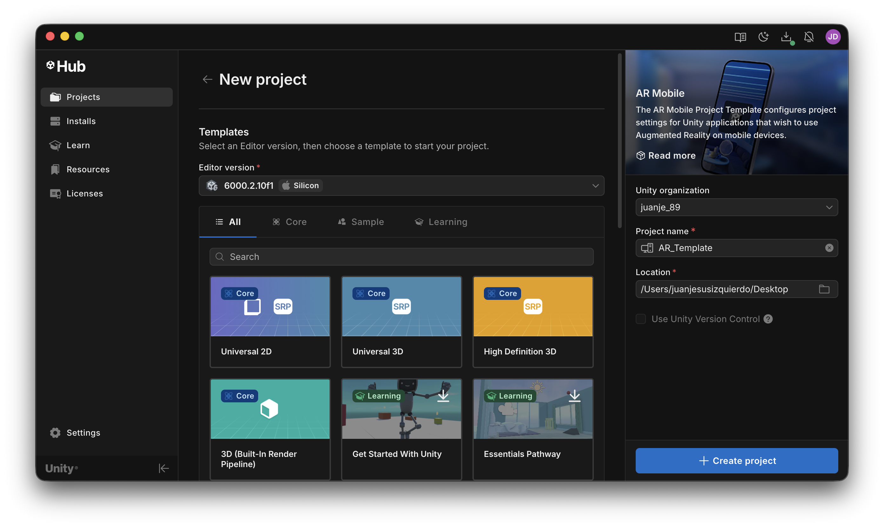<figcaption></figcaption></figure>

<figure>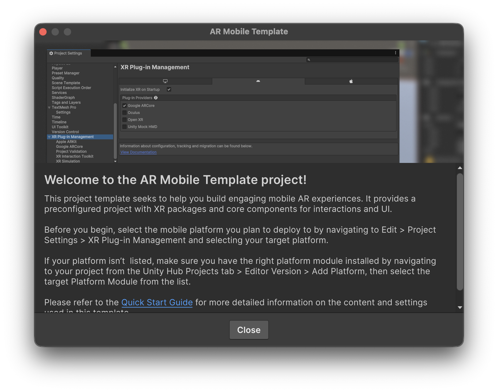<figcaption></figcaption></figure>


This option already installs the plugins for us, though we still need to **activate the providers**!


***

### Activating the providers

dddRegardless of the option you choose, for each installed module you must enable its plugin provider in the **Player Settings** window, under the **XR Plug-in Management** window:

<figure>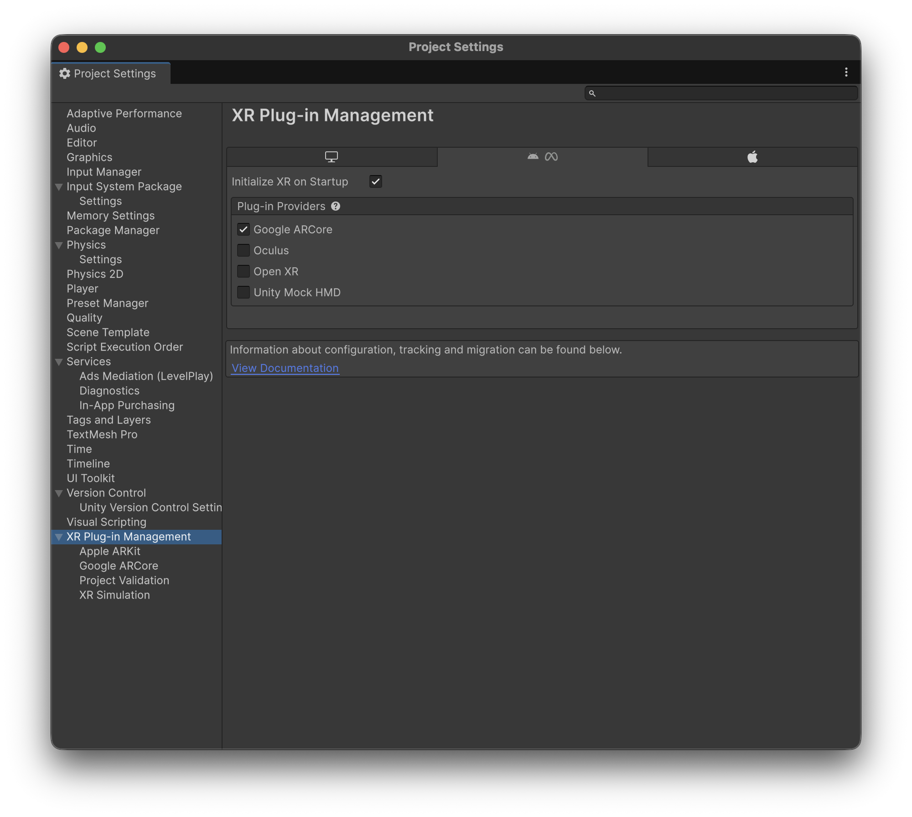<figcaption>
Activating the Android ARCore provider
</figcaption></figure>

<figure>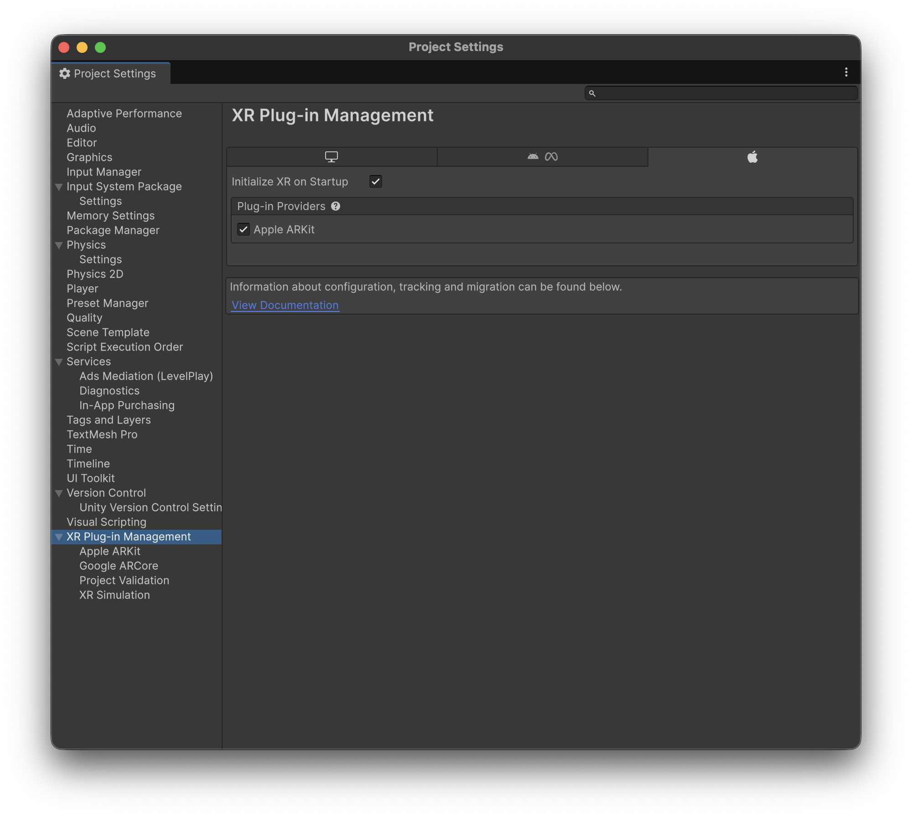<figcaption>
Activating Apple's ARKit provider
</figcaption></figure>

That same window also indicate us if we need to do some <mark style="background-color:$warning;">**fixes on the project configuration**</mark>, depending on the target platform:

<figure>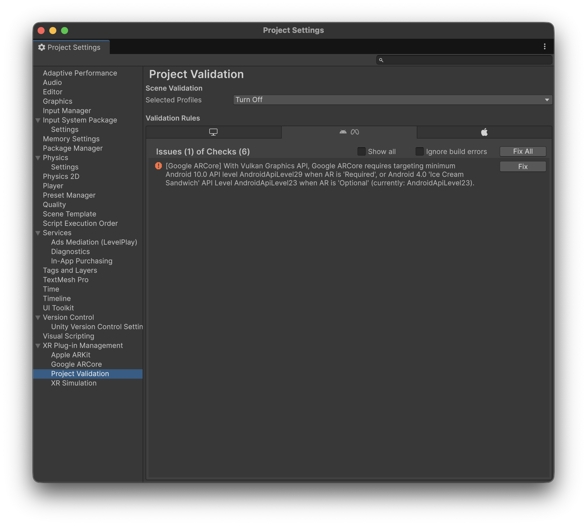<figcaption></figcaption></figure> <figure>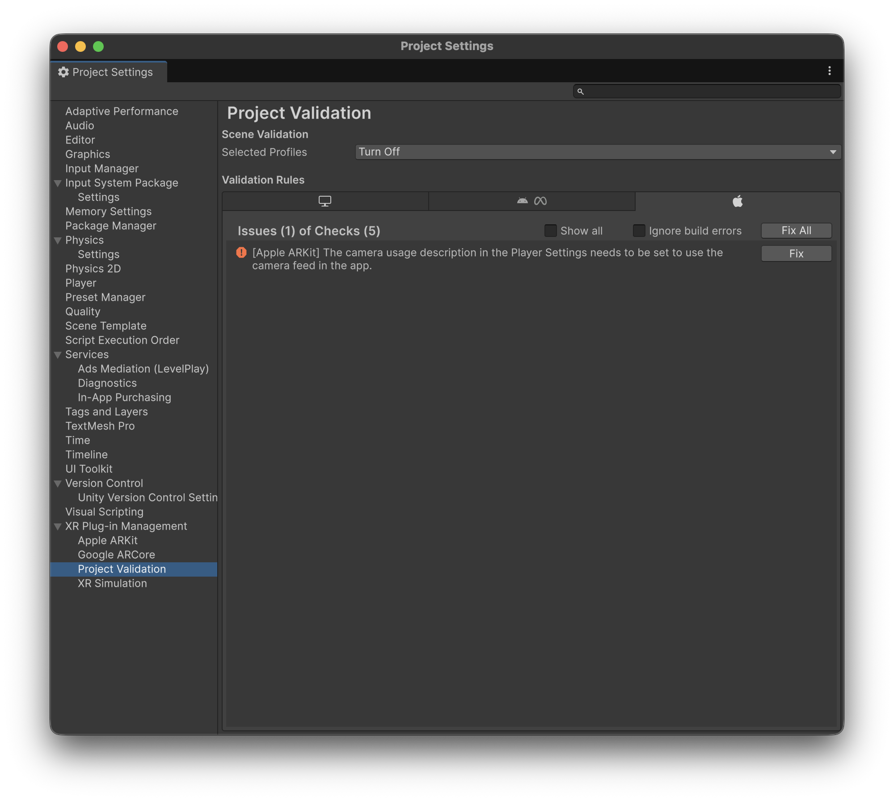<figcaption></figcaption></figure>

