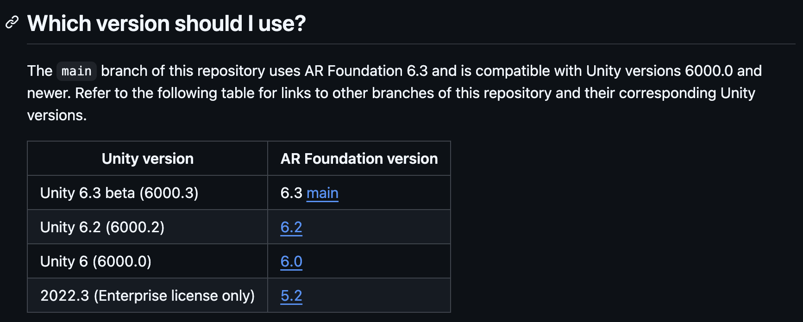
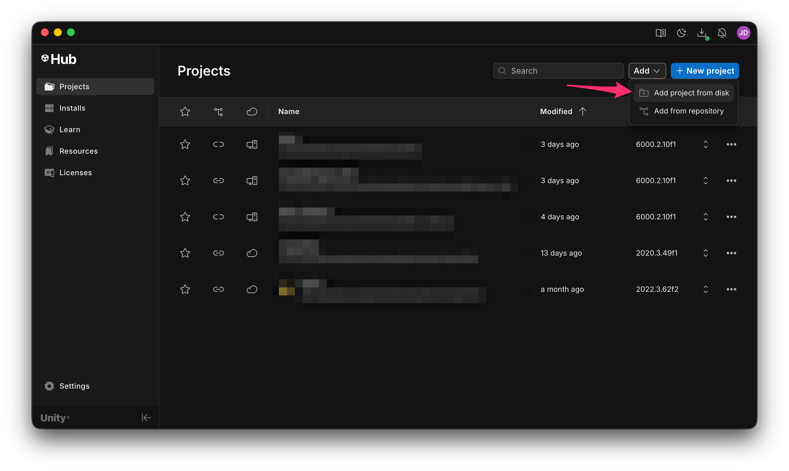
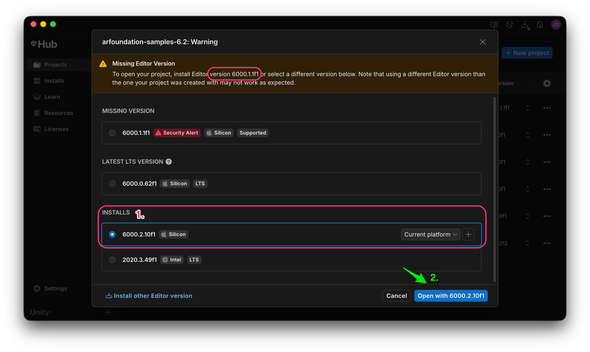
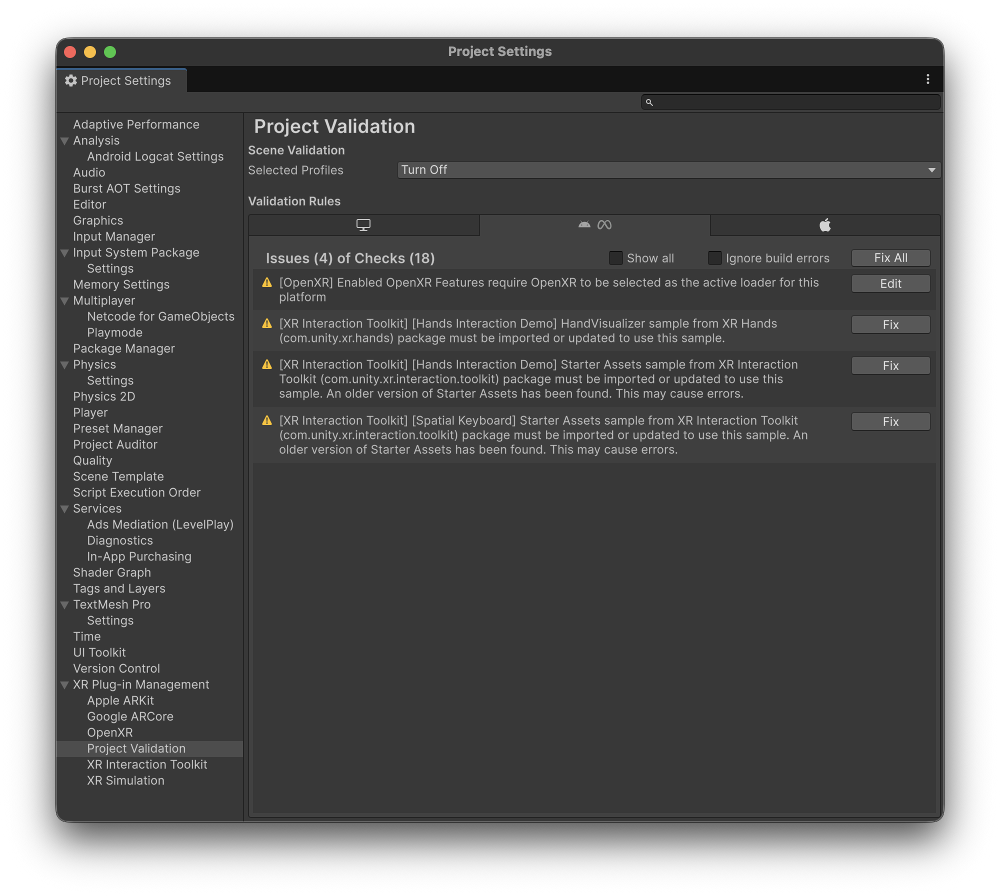

# Working with the samples project

Setting up a project and a scene in **AR Foundation** is not as straightforward as with **Vuforia**.

For this reason, Unity provides a **repository** with example scenes that demonstrate how to use the framework’s features:



***

Depending on the Unity version you have installed, you will have to select a specific branch of the repository to clone/download:

<figure><figcaption></figcaption></figure>


For example, if we're using Unity 6.2, we should download the repository at the following URL:

[https://github.com/Unity-Technologies/arfoundation-samples/tree/6.2](https://github.com/Unity-Technologies/arfoundation-samples/tree/6.2)


Once downloaded, in the Unity Hub, we need to add a new project form disk:

<figure><figcaption></figcaption></figure>


Whenever we try to open an already created Unity project BUT we don't have the Unity version used to create that project, Unity Hub gives as a warning.

We need to select if we want to **UPGRADE** to a new Unity version (from the installed ones), or **DOWNLOAD** the original version.

In this case, we will **UPGRADE** from Unity 6.1.1 to 6.2.10.


<figure><figcaption>
Upgrading the downloaded project to a newer version
</figcaption></figure>

As soon as the project opens, the Project Validation window will open. It is suggested that you fix all the issued now by clicking on the "**Fix All**" button for every platform. Additionally, this examples project already has the **Provider Plug-ins installed by default**:

<figure><figcaption></figcaption></figure>
