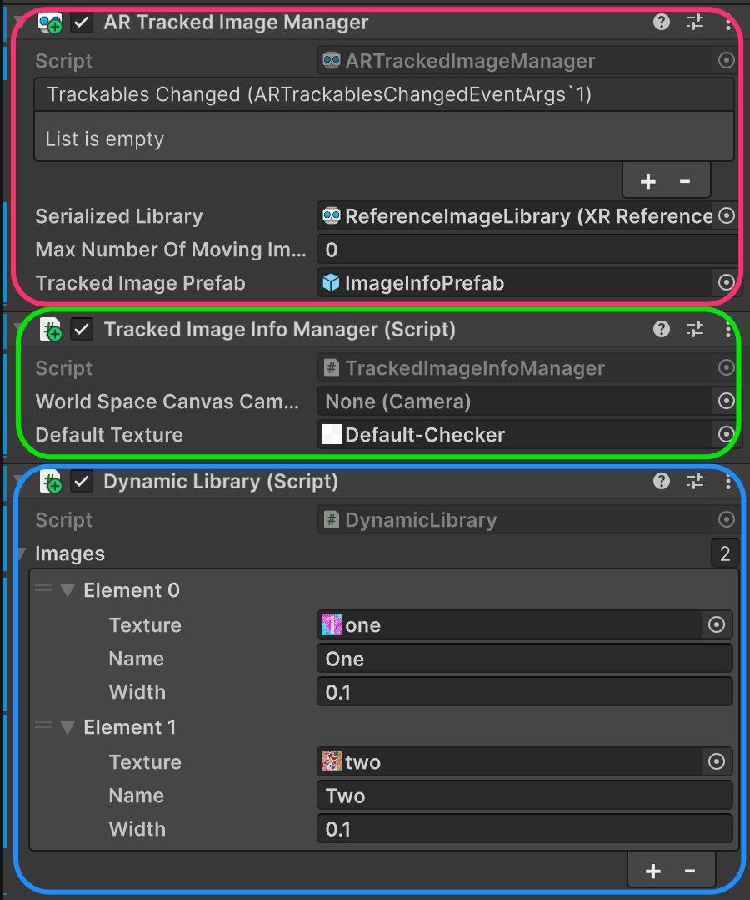

# Basic Image Tracking scene

This scene allows us to understand how we can use ARFoundation to perform one of the most basic AR tracing methods, Image Tracking.

ARFoundation allows us to follow two approaches to set the images:

1. Specifying the pictures at **compile time**, using an [XR Reference Image Library](https://docs.unity3d.com/Packages/com.unity.xr.arfoundation@6.2/manual/features/image-tracking/reference-images.html)
2. Load the pictures at [**runtime**](https://docs.unity3d.com/Packages/com.unity.xr.arfoundation@6.2/manual/features/image-tracking/mutable-libraries.html) (see `DynamicLibrary` component)&#x20;

<figure><figcaption></figcaption></figure>

<figure><figcaption>
Using a compiled library
</figcaption></figure> <figure><figcaption>
Loading the library at run-time (after pressing the button on the top)
</figcaption></figure>


Unlike Vuforia, we cannot prepare the anchored content inside the Unity editor, but we have to do it using code.&#x20;

