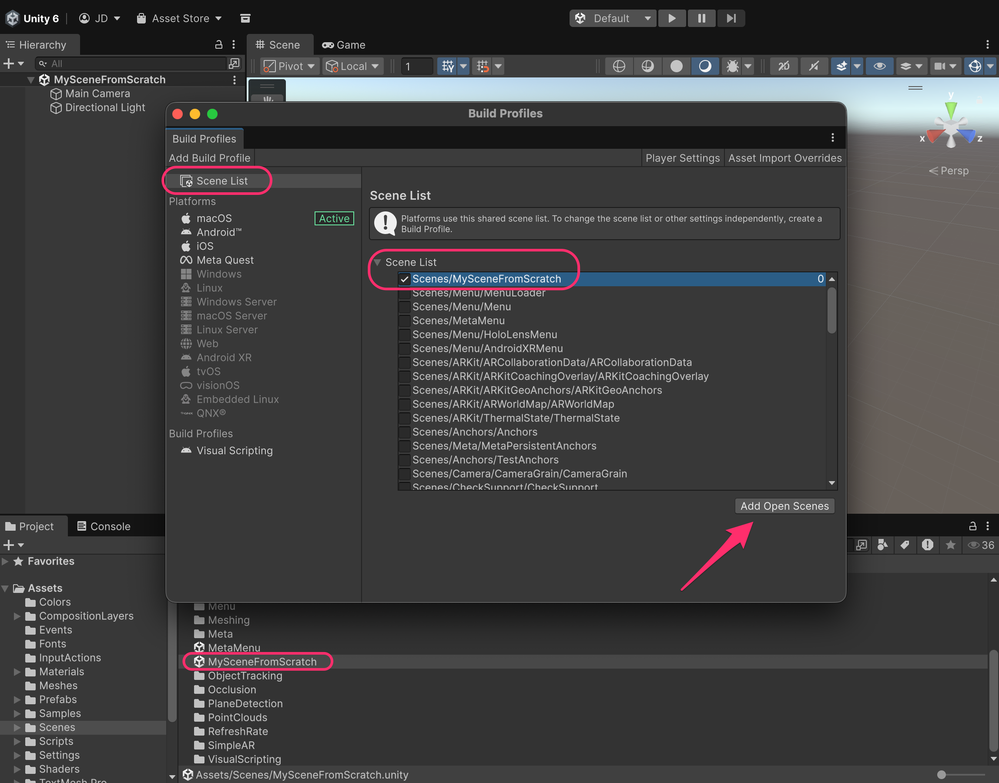
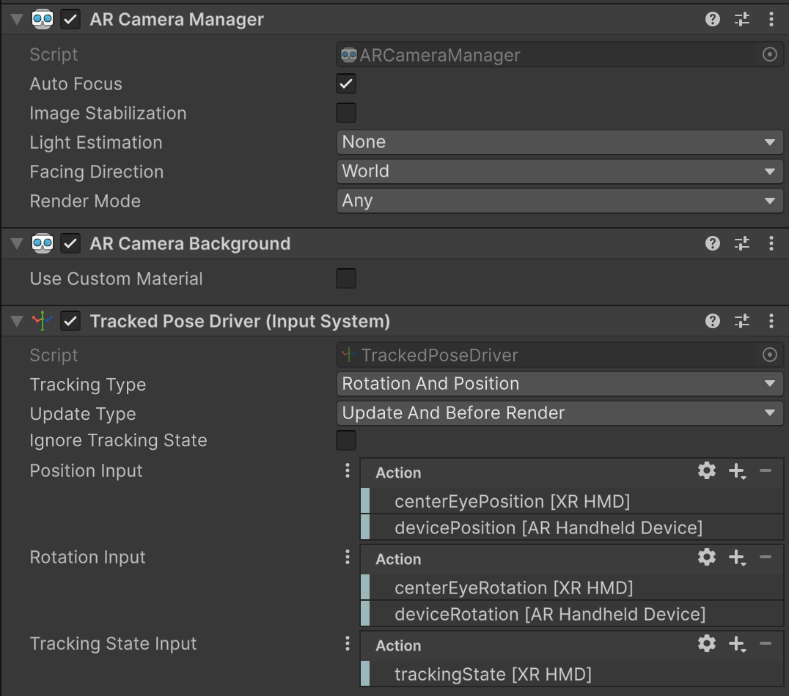
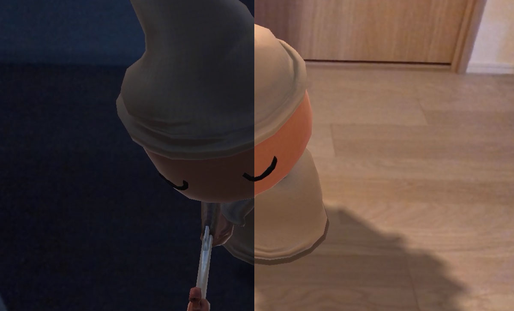
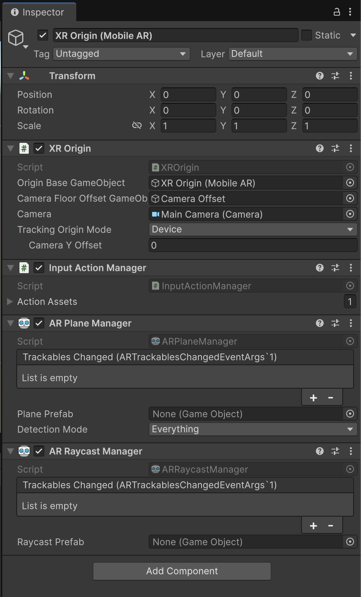

# Creating an AR scene from scratch

Before looking at the most relevant example scenes, let’s go through a step-by-step example of how we could start working with AR Foundation in a scene from scratch:

* Create a new scene and save it
* Add it to the **Build Profiles** window, placing it first and disabling all the others

<figure><figcaption><p>Disable all the scenes form the sample project, and add yours</p></figcaption></figure>

* Remove the _Main Camera_ GameObject
* Create a new GameObject right-clicking on the **Hierarchy** window, _XR_ → _XR Origin (Mobile AR)_


The [_**XR Origin**_](https://docs.unity3d.com/6000.2/Documentation/Manual/xr-origin.html) is the central reference point for tracking space in an XR scene. It is a group of GameObjects and components that transform device-reported tracking data into Unity’s world space:

1. **Center of Tracking Space**\
   XR devices pick an origin point in the real world when the application starts. All tracked poses (HMD, controllers, hands, AR device, etc.) are reported relative to this physical origin.
2. **Transforms Device Tracking Into Scene Space**\
   If raw tracking data were used directly, the user would always appear at `(0, 0, 0)` in the scene.\
   The _XR Origin_ converts this data so the user appears where you want them to be in the Unity scene.
3. **Hierarchy of Tracked Entities**\
   Inside the _XR Origin_, child GameObjects, like the **Camera** representing the user’s headset or AR device, automatically inherit the correct world transforms.
4. **Scene Placement & Orientation**\
   You can position and rotate the _XR Origin_ itself in the scene to define where and how the user appears when the experience begins.
5. **Supports Player Locomotion**\
   While the user’s tracked devices move relative to the _XR Origin_, the _XR Origin_ can be moved programmatically (e.g., teleportation or smooth locomotion).


This _**XR Origin**_ GameObject has a child GameObject with the AR camera, which includes certain specific [components](https://docs.unity3d.com/Packages/com.unity.xr.arfoundation@6.2/manual/features/camera/camera-components.html):

<figure><figcaption><p>Components of the AR camera</p></figcaption></figure>



The **`ARCameraManager`** controls the device camera in AR experiences and provides access to key camera-related features:

<figure><figcaption></figcaption></figure>

1. **Auto Focus**\
   Toggles the camera’s automatic focus mode. When disabled, the camera uses fixed focus.
2. **Image Stabilization**\
   Helps reduce shakiness in the camera feed. Support varies by platform.
3. **Light Estimation**\
   Allows the AR system to estimate environmental lighting so virtual objects blend naturally with the real world. Device support varies, and not all features can always be combined. It can request:
   * _Ambient Intensity_ (overall brightness)
   * _Ambient Color_ (average color)
   * _Ambient Spherical Harmonics_ (complex lighting data for realistic shading)
   * _Main Light Direction_ (direction of the primary light source)
   * _Main Light Intensity_ (brightness of the main light
4. **Facing Direction**\
   Selects which physical camera to use:
   * **World** → rear camera
   * **User** → front (“selfie”) camera
5. **Render Mode**\
   Defines when the camera background is drawn in Unity’s render pipeline:
   * **Any**: provider decides
   * **Before Opaques**: renders the full camera feed before opaque geometry (default)
   * **After Opaques**: renders only non-occluded camera pixels after opaque geometry, useful for optimization



The **`ARCameraBackground`** component renders video from the device camera as the background of the scene. Enable this component to render the AR background, and disable it to disable background rendering.



The **`TrackedPoseDriver`** in Unity is a component that takes the real-world position and orientation of an XR device (like a headset, controller or hand-held device) and automatically applies those values to a GameObject in your scene, so the virtual camera or controller moves exactly as the real-device moves.



* Create a new GameObject form the **Hierarchy** window, _XR → AR Session_


The [**`ARSession`**](https://docs.unity3d.com/Packages/com.unity.xr.arfoundation@6.2/manual/features/session/arsession.html) component manages the entire AR experience’s lifecycle. When active, it starts the device’s AR subsystem; when disabled, it stops AR and halts tracking. On non-OpenXR platforms, toggling ARSession enables or disables AR features in the build.

Key responsibilities:

* **Start/Stop AR session** — enabling/disabling ARSession initiates or ends tracking and environment detection.
* **Session state management** — you can query the current session status (e.g. checking if AR is supported, if setup is done, or if tracking has started) through `ARSession.state`.
* **Configuration options** — e.g. on supported platforms you can set `attemptUpdate` (to prompt software updates if needed), or configure frame-rate synchronization to match AR subsystem updates.


***

The basic scene has been prepared and, if we build the app on a device, it should open the camera; however, we need to specify which trackables we want to track. We can see the documentation what kind of trackables are available:



### Most common Trackables

<table><thead><tr><th width="291.1171875">Trackable Manager</th><th>Purpose / Description</th></tr></thead><tbody><tr><td><strong><code>ARPlaneManager</code></strong></td><td>Detect and track flat surfaces (floors, walls, tabletops), useful to place virtual objects anchored to real-world planes.</td></tr><tr><td><strong><code>ARPointCloudManager</code></strong></td><td>Detect and track feature points (point-cloud data) from the environment — useful for spatial awareness, custom placement logic or meshing.</td></tr><tr><td><strong><code>ARAnchorManager</code></strong></td><td>Manage anchors — stable, persistent points in space (independent of planes) to which you can attach virtual content and keep it locked in place.</td></tr><tr><td><strong><code>ARRaycastManager</code></strong></td><td>Perform raycasts against tracked surfaces/points to detect where virtual objects could be placed (e.g. tapping on floor → hit a plane or feature point).</td></tr><tr><td><strong><code>ARTrackedImageManager</code></strong></td><td>Detect and track 2D reference images in the physical environment (from a reference image library), enabling image-based triggers or content placement.</td></tr><tr><td><strong><code>AREnvironmentProbeManager</code></strong></td><td>Capture environment data (cubemaps) to enable realistic lighting/reflections of virtual content based on real-world lighting and environment.</td></tr><tr><td><strong><code>ARFaceManager</code></strong></td><td>Detect and track human faces in view — useful for face-based AR effects, filters, or facial interactions.</td></tr><tr><td><strong><code>ARTrackedObjectManager</code></strong></td><td>Detect and track 3D objects (when supported) — allows AR experiences to react to real-world 3D objects recognized by the device.</td></tr></tbody></table>

* To keep it simple,  let's work with the [`ARRaycastManager`](https://docs.unity3d.com/Packages/com.unity.xr.arfoundation@6.2/manual/features/raycasts.html#ar-raycast-manager-component) and an [`ARPlaneManager`](https://docs.unity3d.com/Packages/com.unity.xr.arfoundation@6.2/manual/features/plane-detection.html#ar-plane-manager-component) that are already present in the _XR Origin_ GameObject

<figure><figcaption></figcaption></figure>

* Drag the "**AR Plane Debug Visualizer**" prefab into the "Plane Prefab" slot of the `ARPlaneManager` component, and, if you run the app, you should see something like this when moving your phone:

<figure><figcaption><p>The plane manager is in charge of detecting horizontal and vertical surfaces</p></figcaption></figure>

* To place a GameObject in the world, create it and make a prefab out of it (such as a cube)


Take into account the SCALE and the ORIGIN POSITION (This position will be the one that will intersect with the plane)


* Attach the following script to the **XR Origin** GameObject:

```csharp
using System.Collections.Generic;
using UnityEngine;
using UnityEngine.XR.ARFoundation;
using UnityEngine.XR.ARSubsystems;

[RequireComponent(typeof(ARRaycastManager))]
public class PlacePrefabOnPlane : MonoBehaviour
{
    [Tooltip("Prefab to spawn on tap")]
    public GameObject placedPrefab;

    private GameObject _spawnedObject;
    private ARRaycastManager _mRaycastManager;
    
    private static readonly List<ARRaycastHit> SHits = new();

    private void Awake()
    {
        _mRaycastManager = GetComponent<ARRaycastManager>();
    }

    private void Update()
    {
        // No touch
        if (Input.touchCount == 0)
            return;

        // Only start touching the screen, no long press, no several fingers, no drag...
        Touch touch = Input.GetTouch(0);
        if (touch.phase != TouchPhase.Began)
            return;

        // If the raycast generates hit a plane
        if (_mRaycastManager.Raycast(touch.position, SHits, TrackableType.PlaneWithinPolygon))
        {
            // Raycast hits are sorted by distance, so the first one is the closest hit
            var hitPose = SHits[0].pose;

            // Spawn object or move it
            if (!_spawnedObject)
                _spawnedObject = Instantiate(placedPrefab, hitPose.position, hitPose.rotation);
            else
            {
                _spawnedObject.transform.position = hitPose.position;
                _spawnedObject.transform.rotation = hitPose.rotation;
            }
        }
    }
}
```

* Once attached, drag the prefab into the "placePrefab" slot, and run the app on your phone. Whenever you touch on the surface, the cube will move to that position


Just remember to activate both **Input Systems** (old and new) in the **Player Settings** window!


<figure><figcaption></figcaption></figure>
