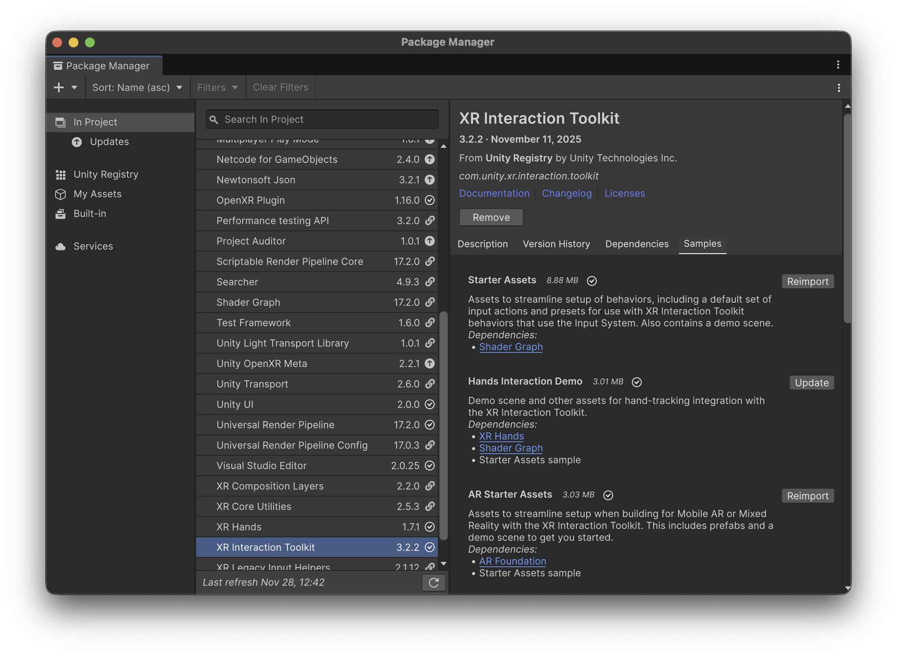
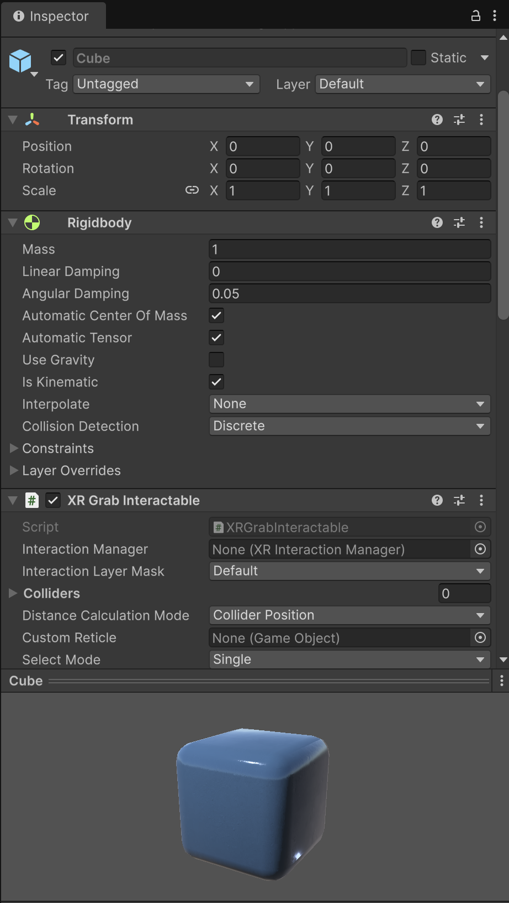

# Interaction scene


To load this scene, we should first import the **AR Starter Assets** samples from the XR Interaction Toolkit Package



This scene, located inside the _AR Starter Assets_ folder (inside the root _Samples_ folder), allows us to spawn cubes and interact with them either by **selecting** them, **translating** them, **rotating** them and **scaling** them, using touch gestures such as one finger swipe, or two finger pinch.

<figure><figcaption></figcaption></figure>

This is possible thanks to a special component called `ARTransformer`.

<figure><figcaption></figcaption></figure> <figure><figcaption></figcaption></figure>

