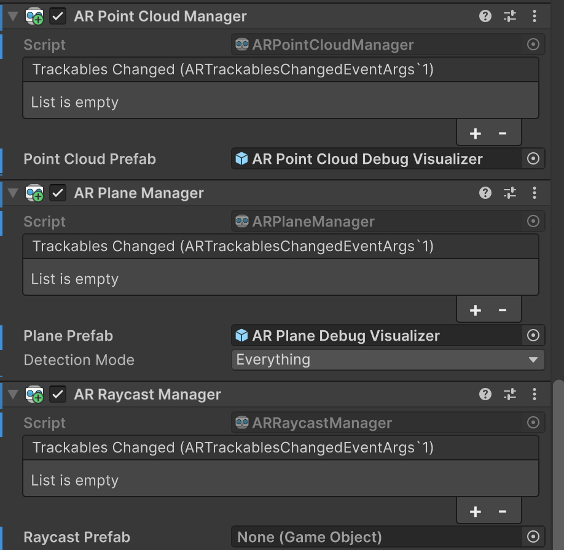

# Simple AR scene

This scene is very similar to the one we created from scratch, however, we can see:

* How to **pause**, **resume** and **reset** and `ARSession`
* How the `ARPointCloudManager` to see the feature points (e.g., the yellow dots) ARFoundation uses to **track the environment**

<figure><figcaption></figcaption></figure>

<figure><figcaption>
Simple plane detection
</figcaption></figure> <figure><figcaption>
Yellow dots in the environment are the feature points
</figcaption></figure>

